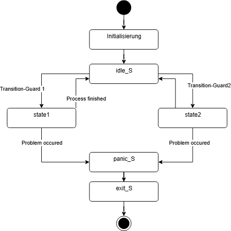

# State Machine Demonstration

## Beschreibung (Deutsch)

Dieses Programm dient dazu, die prinzipielle Implementierung einer Zustandsmaschine (State-Machine) für eine interaktive Anwendung zu demonstrieren. Es erfüllt keine tiefgreifende Funktion, sondern stellt lediglich die Zustände und Transition-Guards dar, die in einer State-Machine verwendet werden können.

Die Zustandsmaschine besteht aus:
- **Panic State**: Wird bei Problemen aktiviert und führt zum Beenden der Maschine.
- **Idle State**: Ein Leerlaufzustand, in dem die Maschine auf Ereignisse wartet.
- **Betriebszustände (State1, State2)**: Führen spezifische Prozesse aus.
- **Exit State**: Signalisiert das Beenden der Maschine.

### Verwendung

1. Kompilieren Sie den Code mit einem beliebigen C++-Compiler.
2. Führen Sie das Programm aus und beobachten Sie die Zustandsübergänge basierend auf den definierten Transition-Guards.

### Ressourcen

- [Vorlesungsfolien zu Programmierung 101](https://github.com/MaxClerkwell/programming101/)
- Folgen Sie mir auf [X.com](https://x.com/MaxClerkwell) für Updates.

---

## Description (English)

This program is designed to demonstrate the fundamental implementation of a state machine for an interactive application. It does not perform a significant function but merely illustrates states and transition guards within a state machine.

The state machine consists of:
- **Panic State**: Activated during problems and leads to the machine's termination.
- **Idle State**: A state where the machine waits for events.
- **Operational States (State1, State2)**: Perform specific processes.
- **Exit State**: Signals the machine's termination.

### Usage

1. Compile the code using any C++ compiler.
2. Run the program and observe the state transitions based on the defined transition guards.

### Resources

- [Programming 101 Lecture Slides](https://github.com/MaxClerkwell/programming101/)
- Follow me on [X.com](https://x.com/MaxClerkwell) for updates.
